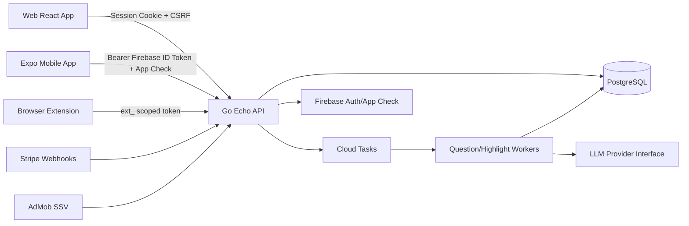
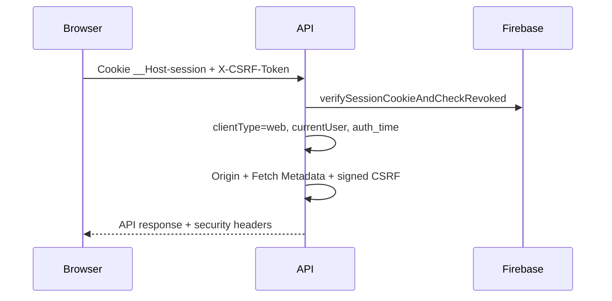
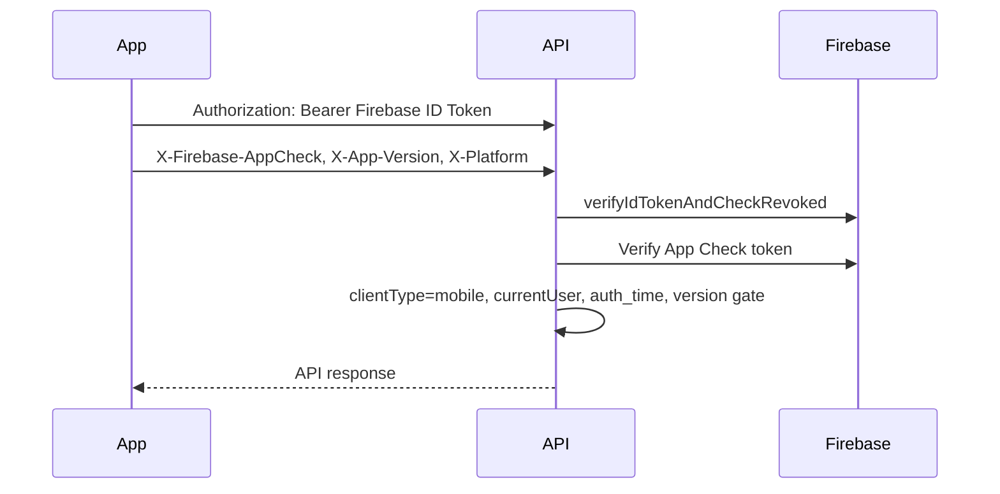
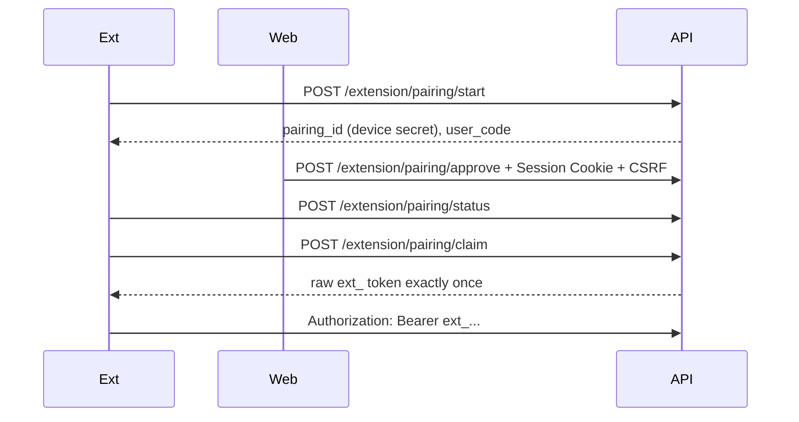
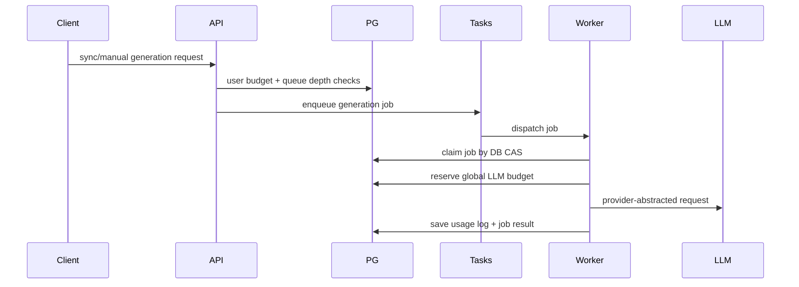
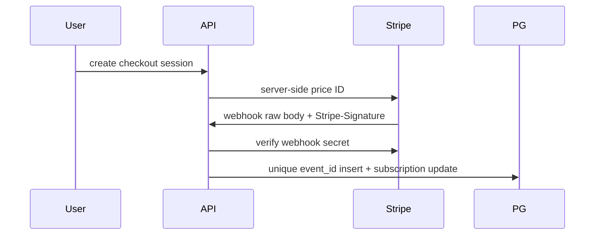
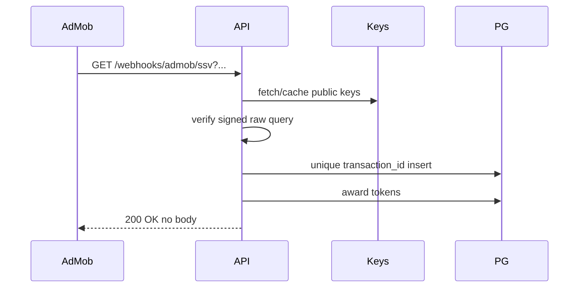

# Security Architecture

This document summarizes the security design for the AI Study Tool backend,
web app, mobile app, and browser extension. It focuses on the controls added in
PR1 through PR7 and the operational risk they reduce.

## System Overview

The backend keeps Clean Architecture boundaries:

- `handler`: HTTP input/output, authenticated user extraction, DTO mapping.
- `middleware`: authentication, CSRF, App Check, version gate, scopes, headers.
- `usecase`: business rules, budget checks, queue decisions, idempotency order.
- `domain`: pure types, interfaces, constants, errors.
- `repository` / `infrastructure`: PostgreSQL, Firebase, Stripe, AdMob, LLM, Cloud Tasks.

## Authentication Flows

HybridAuth chooses exactly one credential path per request:

1. If a Web Session Cookie is present, the request is Web and unsafe methods
   must pass CSRF, Origin, and Fetch Metadata checks. Cookie wins over Bearer so
   a browser request cannot bypass CSRF by also sending an Authorization header.
2. If `Authorization: Bearer ext_...` is present, the request is Extension and
   only route scopes/extension token checks apply. Extension tokens do not use
   Firebase App Check.
3. If `Authorization: Bearer <Firebase ID Token>` is present, the request is
   Mobile and must pass Firebase ID Token verification plus mobile guards such
   as App Check and version gate.
4. If none match, the request is rejected with 401.

### Web

Web uses Firebase Session Cookie authentication. The cookie can be `HttpOnly`,
which reduces token exfiltration if XSS is found. Cookie authentication is
CSRF-prone, so unsafe methods require Signed Double Submit CSRF:

- `csrf_token` cookie and `X-CSRF-Token` header must match.
- Token format is `csrf_raw.signature`.
- Signature is `HMAC-SHA256(CSRF_SECRET, uid + "." + csrf_raw)`.
- `CSRF_SECRET` is required in production-like environments.
- `CSRF_SIGNING_DISABLED=true` is allowed only outside production-like environments and logs a warning.

### Mobile

Mobile uses Firebase ID Token Bearer authentication. The app gets an ID token
immediately before API calls and does not store refresh tokens manually. App
Check is required in production. Version headers are trusted only after ID Token
and App Check verification; by themselves they are just client metadata.

Recent auth for sensitive operations uses Firebase `auth_time`, not biometric
headers. Biometrics are local app-lock UX, not server authorization.

### Browser Extension

The extension uses a dedicated scoped token instead of Firebase credentials. The
backend stores only `SHA-256(raw_token)` and returns the raw token exactly once.
The default scopes are limited to:

- `highlight:write`
- `highlight:check`
- `extension:revoke-self`

No LLM generation, billing, posting, profile update, or account deletion scope
is grantable to extension tokens.

## LLM Generation Flow

The largest business risk is LLM API abuse and cost explosion. Authentication
alone cannot stop abuse by a valid account, so generation is protected by:

- per-user question budget,
- global daily request and estimated-cost budget,
- queue depth limits by user, book, and global pending jobs,
- Cloud Tasks dispatch controls,
- DB compare-and-set job claiming,
- provider abstraction so Gemini/OpenAI-specific types do not leak into domain/usecase.

Budget reserve happens immediately before the LLM call. Once the worker reaches
the LLM call, the request is treated as consumed even if the provider call or
response validation fails. Prompt text is not stored; usage logs store provider,
model, token counts when available, and estimated cost.

## Payments And Rewards

### Stripe

The client never supplies price or amount. Stripe webhooks are verified with the
raw body and `STRIPE_WEBHOOK_SECRET`. `stripe_events.event_id` gives idempotency.
Subscription state is stored provider-neutrally for Stripe, Apple, and Google.

### AdMob SSV

Ad rewards are granted only through SSV in production. The legacy client
notification route is not registered in production. Duplicate `transaction_id`
values do not award twice. The API does not return token balance or plan data
to Google.

## XSS Controls

- React and React Native render UGC, highlights, explanations, comments, and LLM output as text.
- No source code path uses `dangerouslySetInnerHTML` for user content.
- URL display/navigation is normalized to absolute `http` or `https` only.
- `javascript:`, `data:`, `vbscript:`, `file:`, and relative URLs are rejected or ignored.
- LLM prompt text and raw outputs are not logged as HTML.
- CSP is set by the API; static frontend hosting must mirror equivalent headers.

## IDOR Controls

Handlers resolve the authenticated user from context and pass that user to
usecases. Repository mutations for user-owned resources include owner
conditions such as `WHERE id = $1 AND user_id = $2` or equivalent joins.

Important boundaries:

- highlight updates use current user ID,
- saved/incorrect question lists use current user ID,
- notes on another user's question are rejected,
- extension token self-revoke requires token ID and current user ID,
- token budget changes use server-verified current user or verified SSV user,
- subscription changes come from verified provider webhooks.

Social answering visible questions is intentionally broader. Users may answer
visible questions, but they cannot write notes/explanations to another user's
private resources.

## Secret Management

- Backend secrets are stored in Secret Manager / environment variables.
- Vite/Expo public env prefixes must not contain backend secrets.
- CI runs `scripts/secret_scan.py` to detect high-confidence secret material.
- `.env.example` files use dummy values only.
- Logs must not include cookies, raw tokens, signatures, raw request bodies,
  raw payment payloads, raw query strings, pairing IDs, or prompt text.

## Security Headers

The API sets:

- `Content-Security-Policy`
- `Strict-Transport-Security` in production
- `X-Frame-Options: DENY`
- `X-Content-Type-Options: nosniff`
- `Referrer-Policy: strict-origin-when-cross-origin`
- `Permissions-Policy`

`script-src *` and inline scripts are intentionally not allowed. `style-src
'unsafe-inline'` remains because the current React screens use inline style
attributes extensively; it is scoped to styles only.

## Why PostgreSQL

PostgreSQL is the source of truth for authentication-normalized users, extension
tokens, pairing state, idempotency tables, budgets, queue rows, and usage logs.
It supports transactions, unique constraints, row locks, and conditional updates
needed for idempotency and cost controls.

## Why Cloud Tasks + DB CAS

Cloud Tasks provides delivery and retry control, but retry alone can cause
duplicate work. Workers therefore claim jobs using DB compare-and-set state
transitions and record terminal states. This separates dispatch reliability from
business idempotency.

## Risk Table

| Risk | Primary controls | Not fully prevented | Where to inspect | Next additions |
| --- | --- | --- | --- | --- |
| LLM API abuse | user/global budget, queue depth, DB CAS | slow multi-account abuse below limits | `global_llm_budgets`, `llm_usage_logs`, job tables | anomaly scoring |
| Secret leakage | Secret Manager, secret scan, no public env secrets | already-cloned leaked commits | CI logs, GitHub history, cloud audit | managed secret scanning |
| Stripe fraud | server price ID, webhook signature, event idempotency | provider account compromise | `stripe_events`, `subscriptions` | Stripe alerting |
| XSS | text rendering, safe URLs, CSP | vulnerable dependency rendering HTML | CSP reports, frontend code paths | dependency scanner |
| Account takeover | Firebase revoke, recent auth, logout-all | stolen active session before revoke | Firebase audit, auth logs | account risk scoring |
| IDOR | current user context, owner conditions | newly added unreviewed mutation | repository SQL, handler tests | route ownership checklist |
| Multi-account abuse | global budget, queue depth | low-and-slow abuse | usage logs, user creation patterns | device/risk reputation |
| CSRF | signed CSRF, origin/fetch metadata | compromised same-site origin | CSRF errors, access logs | per-action CSRF metrics |
| AdMob spoofing | SSV signature, transaction idempotency | AdMob key compromise | `admob_ssv_events` | dashboard alerts |
| Unauthorized generation | scope denial, budget checks | compromised full user account | job tables, auth logs | user risk holds |
| MITM | HTTPS/HSTS, Firebase token verification | compromised client device | Cloud Run/LB logs | certificate monitoring |
| Supply chain | lockfiles, CI builds | malicious dependency update | dependency diffs | SCA tooling |
| Open redirect | safe URL policy | future unchecked redirect route | frontend/mobile URL search | redirect allowlist helper |
| Extension token leak | scoped token, hash storage, revoke | highlight import abuse until revoke | `extension_tokens.last_used_at` | token rotation UX |
| Mobile loss | Firebase token revoke, App Check | unlocked local app data | Firebase logs | local secure storage review |

## Interview Summary

The highest-impact risk is LLM API abuse causing runaway cost. A valid user can
still abuse expensive generation, so the design layers user budget, global
budget, queue depth, Cloud Tasks dispatch controls, and DB CAS worker claiming.

Web uses HttpOnly Session Cookies to reduce token theft from XSS, and Signed
CSRF to cover the CSRF weakness of cookies. Mobile uses Bearer Firebase ID
Tokens plus App Check. Browser Extension uses a separate scoped token that can
only import/check highlights. Stripe uses webhook signature verification and
event idempotency. AdMob uses SSV signature verification and transaction
idempotency.
